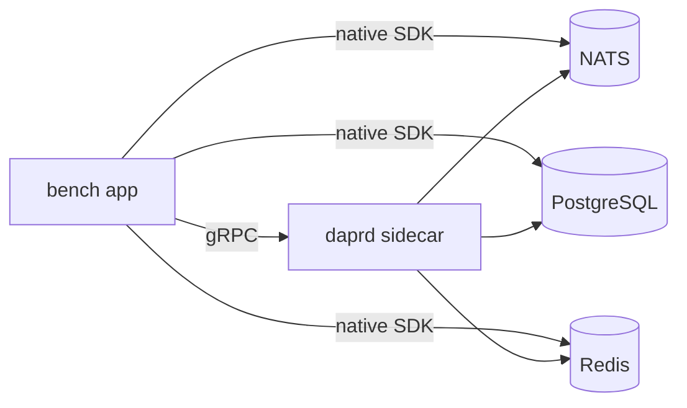
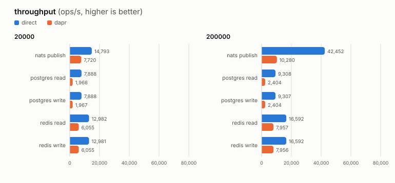
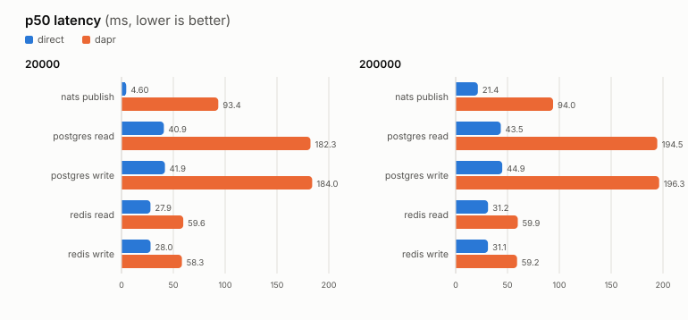

<h1 align="center">Dapr Overhead Benchmark</h1>

<p align="center">
  <em>What does a Dapr sidecar actually cost on the data plane?</em>
</p>

<p align="center">
  Six connectors &middot; three backends &middot; one identical workload &middot; Prometheus metrics
</p>

The same workload runs twice against each of **NATS**, **PostgreSQL** and **Redis**,
once through a native Go SDK, once through Dapr, and both results are exported as
Prometheus metrics. The overhead becomes a division, not a guess.

## The six connectors

| Connector | Path | Operations |
| --- | --- | --- |
| `nats-direct` | app → nats.go (JetStream, acked) | `publish` |
| `nats-dapr` | app → gRPC → daprd → NATS JetStream | `publish` |
| `postgres-direct` | app → pgx → PostgreSQL | `write`, `read` |
| `postgres-dapr` | app → gRPC → daprd → PostgreSQL | `write`, `read` |
| `redis-direct` | app → go-redis → Redis | `write`, `read` |
| `redis-dapr` | app → gRPC → daprd → Redis | `write`, `read` |

Each pair hits the **same server instance** with the **same payload** at the **same
rate**, and all six run **concurrently**, so they share one machine's CPU and IO
weather, and the only difference within a pair is the sidecar hop.



## Quick start

```sh
make up        # build + start backends, bench app, sidecar, Prometheus
make logs      # follow the run
make results   # print all six results and the overhead ratios
make down      # tear everything down
```

Then: bench metrics on <http://localhost:9100/metrics>, the sidecar's own metrics on
<http://localhost:9090/metrics>, Prometheus on <http://localhost:9091>.

## Results

**Dapr's cost depends entirely on which regime you are in.** Under light load it is a
fixed sub-millisecond tax. Under saturation it becomes a ceiling on throughput.

| Regime | Latency cost | Throughput cost |
| --- | --- | --- |
| **Light** — 200 ops/sec, 256 B, concurrency 8 | `+0.2–0.7 ms` (1.8–3.1×) | not saturated |
| **Saturated** — 10 KiB, concurrency 1000 | 1.9–4.5× at p50 | **2.1–4.1× less work done** |

### Throughput is the real story



At saturation the sidecar caps how much work gets through, regardless of how hard the
app pushes (`RATE=200000`, 10 KiB payloads):

| Operation | Direct | Through Dapr | Penalty |
| --- | ---: | ---: | ---: |
| `nats publish` | 42,452 ops/s | 10,280 ops/s | **4.1× less** |
| `postgres read` | 9,308 ops/s | 2,404 ops/s | **3.9× less** |
| `postgres write` | 9,307 ops/s | 2,404 ops/s | **3.9× less** |
| `redis read` | 16,592 ops/s | 7,957 ops/s | 2.1× less |
| `redis write` | 16,592 ops/s | 7,956 ops/s | 2.1× less |

### Latency



> [!NOTE]
> **The sidecar was already saturated at the lower rate.** Between the two runs, Dapr's
> NATS p50 barely moved — `93.4 ms → 94.0 ms` — while the direct path went
> `4.6 ms → 21.4 ms`. Dapr had hit its ceiling in *both* runs; the direct path only
> started to feel the load in the second.
>
> This is why the raw ratio misleads. That same pairing reads as **20.3×** at
> `RATE=20000` and **4.4×** at `RATE=200000` — not because Dapr got faster, but
> because the baseline it is divided by got slower. Quote the absolute numbers.

Under light load the picture is far less dramatic: Dapr adds **0.2–0.7 ms** per
operation, which for most applications is noise against a network round trip.

## Reading the metrics

Raw series, all labelled `backend` / `mode` / `op`:

| Metric | Meaning |
| --- | --- |
| `bench_op_duration_seconds` | per-operation latency histogram |
| `bench_ops_total` | attempts, also labelled `status` |
| `bench_connector_up` | `1` per connector that started — a `0` means a missing result |

Because `mode` is the *only* differing label within a pair, the overhead is a plain
division. The derived views live in [rules.yml](deploy/prometheus/rules.yml):

```promql
bench:latency_p50   bench:latency_p95   bench:latency_p99   # per connector
bench:throughput                                            # successful ops/sec
bench:dapr_overhead_ratio_p50                               # ×  slower than direct
bench:dapr_overhead_seconds_p50                             # +  seconds vs direct
```

### Plotting sampled runs

Capture a run, then plot any number of captures against each other:

```sh
make results > traces/20000.txt    # name each capture after whatever you varied
make results > traces/200000.txt
make plots FILES="traces/*.txt"
```

This writes one SVG per metric into `plots/` — a panel per capture on a shared scale —
and prints the direct-vs-Dapr ratios to stdout. Direct is always blue, Dapr always
orange. It is **standard-library Python only**: no matplotlib, no virtualenv.

A percentile absent from a capture is not plotted, and the script says which it
skipped rather than drawing an empty panel.

## Configuration

All knobs are environment variables on the `bench` service in
[docker-compose.yml](deploy/docker-compose.yml):

| Variable | Meaning |
| --- | --- |
| `PAYLOAD_BYTES` | value size per operation |
| `KEYSPACE` | distinct keys cycled through |
| `CONCURRENCY` | in-flight operations per connector |
| `RATE` | operations/sec per connector (`0` = as fast as possible) |
| `WARMUP` | discarded settling period |
| `DURATION` | run length (`0` = until stopped) |

Payload size is the interesting axis: Dapr's cost is largely per-call, so the relative
overhead shrinks as payloads grow. Concurrency is the other one — it decides which of
the two regimes above you are measuring.

## Fairness notes

Benchmarks like this are easy to rig by accident. Each of these is enforced by the code
and verified against a live run:

- **NATS publishes wait for the JetStream ack on both sides.** Dapr's component calls
  the synchronous `jsc.Publish`, and so does the direct connector. Comparing against a
  fire-and-forget core NATS publish would measure buffering, not overhead.
- **Postgres statement shapes match** — upsert on write, point select on read. Dapr
  uses its own table, so neither path pollutes the other.
- **Sidecar tracing is disabled** — it logs `TraceIDRatioBased{0}` at startup. A trace
  exporter would add latency to the thing being measured.
- **App and sidecar share a network namespace**, exactly like a Kubernetes pod, so the
  gRPC hop is loopback rather than a Docker bridge.
- **Warmup measurements are discarded**, so cold pools do not skew the first seconds.
- **Identical payload, keyspace, rate and concurrency** across all six connectors.

### What the sidecar hop does *not* explain

Dapr's components do not store data the way a direct client would, and none of it is
switchable. It is a real cost of adopting Dapr, so it stays in the measurement — but it
means the overhead is not purely "one gRPC hop":

| | Direct | Through Dapr |
| --- | --- | --- |
| **Redis** | `SET` of a plain string | Lua `EVAL` → `HSET` of `{data, version}`, key prefixed `bench\|\|` |
| **Postgres** | `bytea` | base64 inside `jsonb` (~1.4× the bytes) plus `isbinary` / `insertdate` / `updatedate` / `expiredate` |
| **NATS** | raw payload | CloudEvent envelope plus `Nats-MsgId` dedup |

So Redis in particular is Dapr doing strictly *more work* — a scripted
read-modify-write of a hash — than the plain `SET` it is compared against.

**Not measured at all:** resilience, retries, mTLS, observability, portability. The
sidecar hop buys those things; this project only prices it.

## Layout

```
cmd/bench/            entrypoint: wires the six connectors and runs them
internal/connector/   one file per backend, holding both its direct and Dapr client
internal/runner/      the shared workload driver
internal/metrics/     Prometheus exporter
deploy/               compose stack, Dapr components, Prometheus config + rules
scripts/              results summariser and the SVG plotter
```
